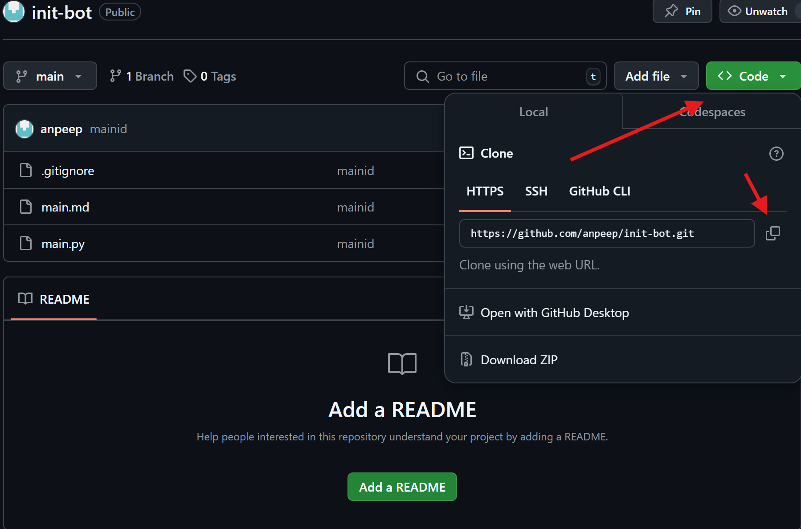
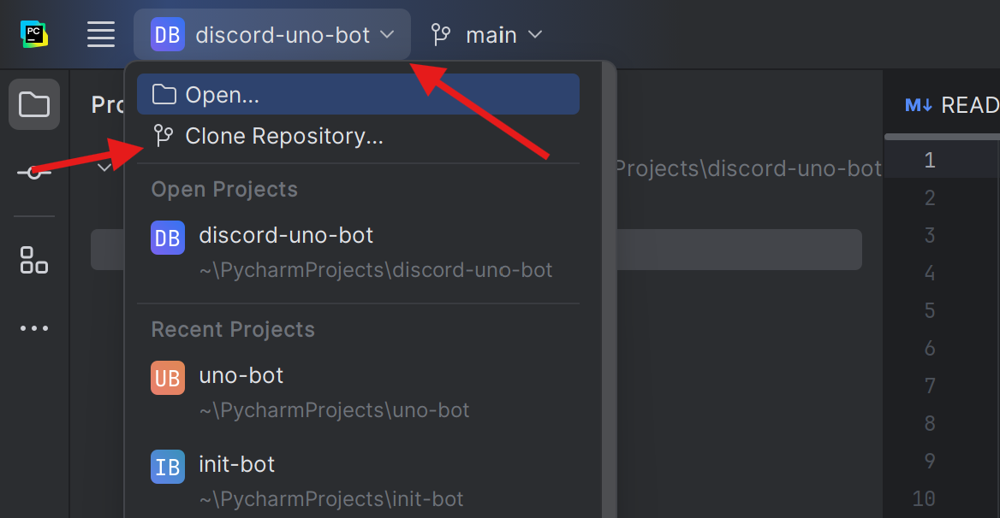
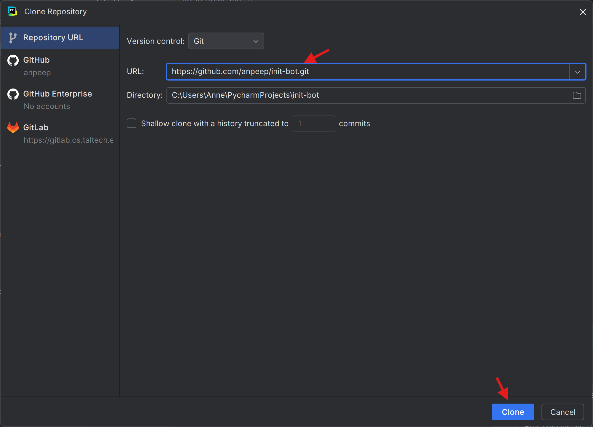
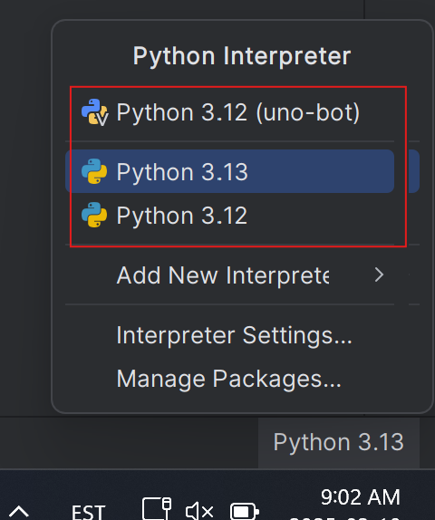
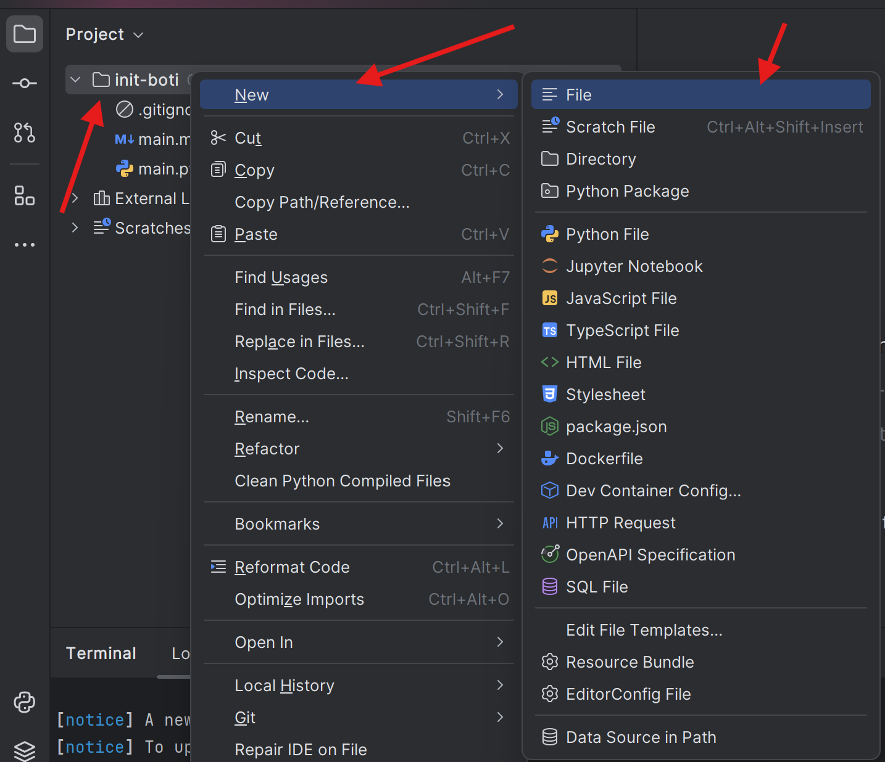
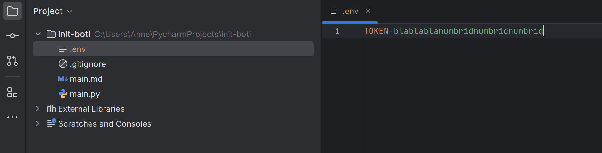
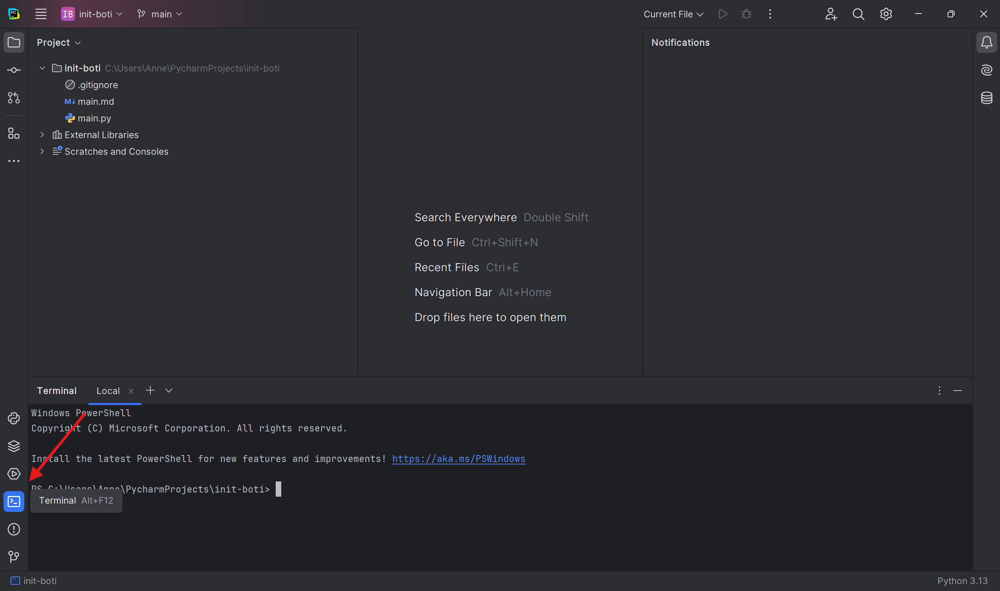

Discordi Boti mall
==================

1. Kopeeri init-boti repo.
Roheline <>code nupp esmaslt, siis HTTPS "copy url to clipboard"



2. Leia kloonimise nupp Pycharmis.
Pycharmi üleval vasakus ääres projekti nimi esmaslt, siis "Clone Repository..."



3. Pane URL-iks kopeeritud link.
Juhul, kui Directory's juba on sellenimeline kaust, lisa Directory reale mõni täht lõppu näiteks ".boti" ".bot" asemel



4. Kontrolli, kas Interpreter on seatud.
Vali ükskõik milline versioon



5. Lisa uus fail.
Klõpsa kaustale esmalt, siis vali tavaline "File"



6. Loo ENV-fail oma Discordi tokenile.
Kirjuta ".env"


7. Lisa oma token.
Kirjuta "TOKEN=" ja pane selle taha oma token



8. Leia terminal.
All vasakus nurgas või Alt+F12



9. Kirjuta terminali:
```
pip install discord 
pip install python-dotenv

```

